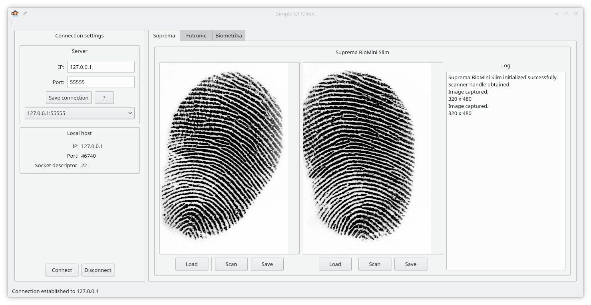

# Qt-client-gui
This repository houses source code for an experimental client app communicating with server over TCP, written in Qt. The app allows to choose IP and port of the server and connect to it. The app demonstrates the process of connecting, disconnecting and notifying about any state changes in TCP connection.

The app now supports scanning fingerprints and transferring them to the server.

Here is the screenshot of the app's GUI.

